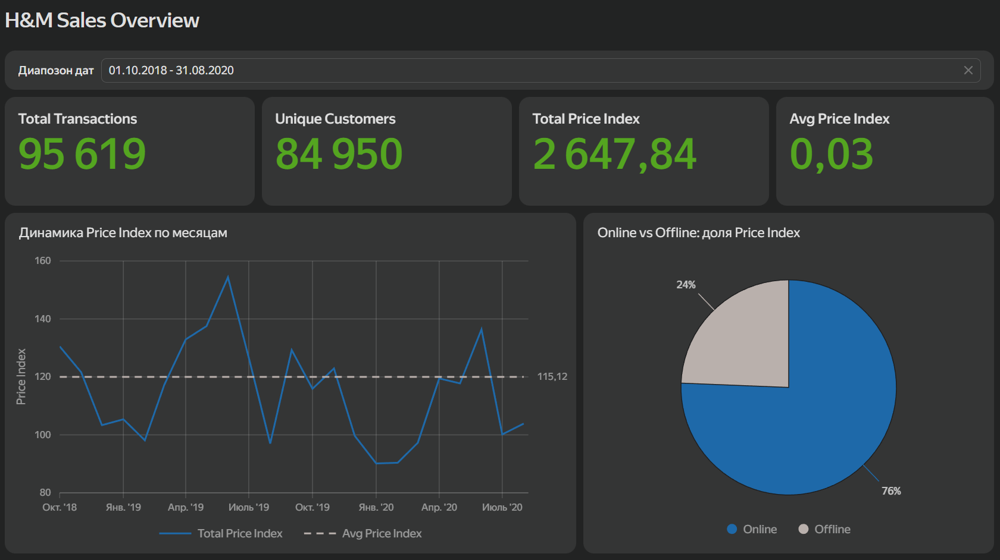
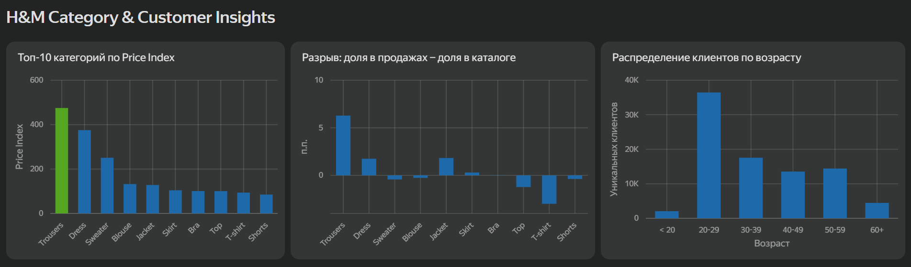

# Аналитика продаж интернет-магазина в Yandex DataLens

Учебный аналитический проект на датасете [H&M Personalized Fashion Recommendations](https://www.kaggle.com/competitions/h-and-m-personalized-fashion-recommendations).

## Дашборды

**[Sales Overview →](https://datalens.yandex/k4dckd58qmhe3)**
Общая картина продаж: ключевые метрики, динамика по месяцам с выделением сезонности, сравнение каналов продаж (online/offline).



**[Category & Customer Insights →](https://datalens.yandex/yitf41z6fadeh)**
Разрез по категориям товаров и клиентам: топ категорий, разрыв между ассортиментом и спросом, демография покупателей.



## О данных

Использован публичный датасет [H&M Personalized Fashion Recommendations](https://www.kaggle.com/competitions/h-and-m-personalized-fashion-recommendations) — реальные транзакции, каталог товаров и данные клиентов сети H&M (~31.8M строк транзакций, период сентябрь 2018 — сентябрь 2020).

Поле `price` в датасете — это не цена в реальной валюте, а нормализованное (отмасштабированное) значение, Поэтому везде в проекте это поле называется **Price Index**. Cравнения между категориями и динамика во времени остаются валидными.

Из-за объёма исходных данных для дашбордов использована пропорциональная выборка (~100k строк из 31.8M), сохраняющая помесячную сезонность — методика и проверка описаны в EDA-ноутбуке.

## Структура репозитория

```
hm-analytics-datalens/
├── README.md
├──  hm_eda.ipynb       # разведочный анализ данных (EDA)
└──  transactions_sample.csv   # сэмплированные данные для DataLens
```

## Что в EDA-ноутбуке

`notebooks/hm_eda.ipynb` — разведочный анализ перед построением дашбордов:

- объём и период данных, базовая статистика, проверка пропусков
- помесячная динамика транзакций и Price Index, поиск сезонности
- расследование природы поля `price` (см. выше)
- топ категорий по каталогу vs по факту продаж
- сезонность по дням недели, демография клиентов
- проверка стратегии сэмплирования: сравнение формы тренда на полных данных и на выборке

## Ключевые инсайты

- Продажи растут к лету (пики в июне обоих лет) — похоже на сезонные распродажи.
- Около 75% Price Index приходится на онлайн-канал.
- Категории Trousers и Jacket недопредставлены в каталоге относительно их доли в продажах; T-shirt — наоборот, перепредставлены.
- Основная аудитория — клиенты 20-29 лет.

## Инструменты

- **Python** (pandas) — подготовка и сэмплирование данных
- **Yandex DataLens** — построение дашбордов
- **Jupyter Notebook** — разведочный анализ данных
